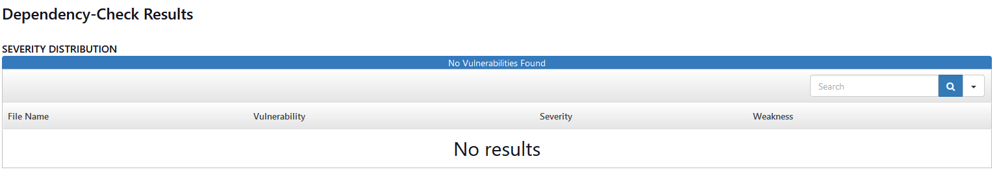

# Jenkins, ArgoCD, and K3s on VirtualBox

## Project Overview

This project demonstrates the implementation of a Continuous Integration and Continuous Deployment (CI/CD) pipeline for a Spring Boot application using Jenkins, ArgoCD, Docker, and Kubernetes (k3s). The pipeline automates the build, test, and deployment processes of the application to a Kubernetes cluster, with security and code quality checks integrated throughout the process. The solution adopts GitOps practices using ArgoCD, allowing for a declarative deployment approach where Kubernetes manifests are stored and version-controlled in a Git repository.

## Key Components

### Jenkins Pipeline

The CI/CD pipeline in Jenkins is defined using a declarative pipeline. It automates the entire process, from code checkout to Docker image deployment on Kubernetes.


```groovy

pipeline {
    agent any

    environment {
        // Define SonarQube environment variables
        SONARQUBE_SERVER = 'sonar-server'  
        GITHUB_REPO = 'https://github.com/yahialm/CICD-pipeline-with-Jenkins-ArgoCD-Sonar-and-K8s.git'
        GITHUB_REPO_MANIFEST = 'https://github.com/yahialm/ArgoCD-pipeline-manifest-files.git'
        SONAR_PROJECT_KEY = credentials('sonar-project') 
        SONARQUBE_TOKEN = credentials('sonar-token')
        NVD_API_KEY = credentials('NVD-API')
        GITHUB_EMAIL = credentials('github-email')
        // GITHUB_TOKEN = credentials('github-token')
        DOCKERHUB_CREDENTIALS = "docker-hub-credentials-id" 
        DOCKER_IMAGE_NAME = 'yahialm/spring'
    }

    stages {

        stage('Checkout') {
            steps {
                // Checkout the code from GitHub
                git branch: 'main', url: "${GITHUB_REPO}"
            }
        }

        stage('Build') {
            steps {
                // Give permissions to mvnw
                sh 'chmod +x mvnw'

                // Build the Spring Boot project using Maven
                sh './mvnw clean install'
            }
        }

        stage('Test') {
            steps {
                // Run tests using Maven
                sh './mvnw test'
            }
        }

        stage('SonarQube Analysis') {
            steps {
                script {
                    // Run SonarQube analysis
                    withSonarQubeEnv("${SONARQUBE_SERVER}") {
                        sh "./mvnw sonar:sonar " +
                           "-Dsonar.projectKey=${SONAR_PROJECT_KEY} " +
                           "-Dsonar.login=${SONARQUBE_TOKEN}"
                    }
                }
            }
        }

        stage('OWASP Dependency Check Scan and Publish') {
            steps {
                script {
                    dependencyCheck additionalArguments: """
                    -o './' 
                    -s './'
                    -f 'ALL' 
                    --prettyPrint
                    --nvdApiKey ${NVD_API_KEY} """, odcInstallation: "dependency-check"

                    dependencyCheckPublisher pattern: 'dependency-check-report.html'
                }
            }
        }

        stage('Build Docker Image') {
            steps {
                script {
                    // Build the Docker image from the Dockerfile
                    sh "docker build -t ${DOCKER_IMAGE_NAME}:${env.BUILD_NUMBER} ."
                }
            }
        }

        stage('Trivy Scan') {
            steps {
                script {
                    // Save Trivy scan result as an HTML report
                    def trivyHtmlReportFile = "trivy-report-${env.BUILD_NUMBER}.html"
                    sh """
                        trivy image --format template --template @/usr/local/share/trivy/templates/html.tpl \
                        ${DOCKER_IMAGE_NAME}:${env.BUILD_NUMBER} > ${trivyHtmlReportFile}
                    """
                    
                    // Publish the HTML report
                    publishHTML([
                        reportName: 'Trivy Security Scan',
                        reportDir: '',
                        reportFiles: trivyHtmlReportFile,
                        keepAll: true,
                        allowMissing: false,
                        alwaysLinkToLastBuild: true,
                        includes: '**/*'
                    ])
                }
            }
        }

        stage('Push Docker Image to DockerHub') {
            steps {
                script {
                    withDockerRegistry([credentialsId: "docker-hub-credentials-id", url: "https://index.docker.io/v1/"]) {
                        // Push the Docker image to DockerHub
                        sh "docker push ${DOCKER_IMAGE_NAME}:${env.BUILD_NUMBER}"
                    }
                }
            }
        }

        stage('Update Kubernetes Manifests') {
            steps {
                script {
                    // Use credentials to authenticate with GitHub
                    withCredentials([string(credentialsId: 'github-token', variable: 'GITHUB_TOKEN')]) {
                        // Clone the private manifest repo using the token
                        sh """
                        if [ -d "ArgoCD-pipeline-manifest-files" ]; then
                             rm -rf ArgoCD-pipeline-manifest-files
                        fi
                        git clone https://${GITHUB_TOKEN}@github.com/yahialm/ArgoCD-pipeline-manifest-files.git
                        cd ArgoCD-pipeline-manifest-files/k3s
                        sed -i 's|image: .*|image: ${DOCKER_IMAGE_NAME}:${env.BUILD_NUMBER}|' deployment.yaml
                        """

                        // Commit and push the changes back to the repo
                        // Each sh command has its own specific context, e.g if cd Argo... command was executed individually wrapped
                        // in its own sh """""", that might create problems for the next commands because they will  
                        // be executed in the default path which is the workspace but not inside ArgoCD-pipeline-manifest-files
                        sh """
                            cd ArgoCD-pipeline-manifest-files
                            git config --global user.email "${GITHUB_EMAIL}"
                            git config --global user.name "yahialm"
                            git add k3s/deployment.yaml
                            git commit -m "Updated image to ${DOCKER_IMAGE_NAME}:${env.BUILD_NUMBER}"
                            git push https://${GITHUB_TOKEN}@github.com/yahialm/ArgoCD-pipeline-manifest-files.git main
                        """
                    }
                }
            }
        }

    }

    post {
        always {
             // Archive the built artifacts and test results
             archiveArtifacts artifacts: '**/target/*.jar', allowEmptyArchive: true

            // Clean the workspace
            cleanWs()
        }
        failure {
            // Notify on failure
            echo 'Build failed!'
        }
        success {
            // Notify on success
            echo 'Build succeeded!'
        }
    }
}

```

### Dockerfile

The Dockerfile for building and packaging the Spring Boot application is designed using a multi-stage build approach. This keeps the final image lightweight and efficient.


```Dockerfile
FROM maven:3.8.6-jdk-11-slim AS build
WORKDIR /app
COPY . .
RUN mvn clean package

FROM openjdk:11-jre-slim
WORKDIR /app
COPY --from=build /app/target/*.jar app.jar
EXPOSE 8989
CMD ["java", "-jar", "app.jar"]
```

### GitOps with ArgoCD

GitOps is a paradigm where the desired state of the system (infrastructure and applications) is defined declaratively in Git, and the actual state of the system is automatically reconciled to match this. ArgoCD is a tool that implements GitOps by continuously monitoring a Git repository for changes and applying those changes to a Kubernetes cluster.

In this project, ArgoCD is configured to monitor the Git repository where the Kubernetes manifest files are stored. Whenever changes are pushed to the repository (such as an updated Docker image), ArgoCD automatically applies those changes to the Kubernetes cluster.


### Kubernetes Manifests

The Kubernetes manifests include the necessary configuration for deploying the Spring Boot application to a k3s cluster.

```yaml
apiVersion: apps/v1
kind: Deployment
metadata:
  name: my-app-deployment
  labels:
    app: my-app
spec:
  replicas: 2  
  selector:
    matchLabels:
      app: my-app
  template:
    metadata:
      labels:
        app: my-app
    spec:
      containers:
      - name: my-app-container
        image: yahialm/spring:78
        ports:
        - containerPort: 8085
        env:
        - name: ENVIRONMENT
          value: "production"
        resources:
          limits:
            memory: "512Mi"
            cpu: "500m"
          requests:
            memory: "256Mi"
            cpu: "250m"
```

```yaml
apiVersion: v1
kind: Service
metadata:
  name: my-app-service
  labels:
    app: my-app
spec:
  type: LoadBalancer
  ports:
    - port: 80
      targetPort: 8085
  selector:
    app: my-app
```


### SonarQube Integration

SonarQube is integrated into the pipeline to ensure code quality and security by analyzing the codebase for potential issues.

The pipeline automatically runs a SonarQube analysis after the code is built, sending the results to a SonarQube server.

### Security Scanning with OWASP Dependency Check and Trivy

Security checks are performed using OWASP Dependency Check and Trivy:

- **OWASP Dependency Check**: Scans the application’s dependencies for known vulnerabilities, with a detailed report generated and published in Jenkins.


  
- **Trivy**: Scans the Docker image for vulnerabilities, with the results displayed in a detailed HTML report in Jenkins.


## Workflow Summary


1. **Code Checkout**: Jenkins checks out the latest version of the Spring Boot application from the Git repository.

2. **Build and Test**: The application is built using Maven, and unit tests are executed.

3. **SonarQube Analysis**: The code is analyzed using SonarQube to ensure code quality and identify potential issues.

4. **Security Scanning**: The pipeline performs security scans using OWASP Dependency Check and Trivy to detect vulnerabilities in the code and Docker image.

5. **Docker Image Creation**: The application is packaged into a Docker image using a multi-stage Dockerfile.

6. **Update Kubernetes Manifests**: The Kubernetes deployment manifest is updated to use the newly built Docker image.

7. **GitOps Deployment with ArgoCD**: The updated Kubernetes manifests are pushed to a Git repository, which is monitored by ArgoCD. ArgoCD automatically deploys the changes to the k3s cluster.

8. **Continuous Monitoring and Rollbacks**: ArgoCD continuously monitors the application, ensuring that the actual state matches the desired state as defined in Git. In the event of a failure, ArgoCD can perform rollbacks to a previous state.

## Conclusion

This project implements a fully automated CI/CD pipeline using Jenkins, Docker, Kubernetes, and ArgoCD, with integrated security and code quality checks. By adopting GitOps practices, the deployment process becomes more efficient and reliable, allowing for easy rollbacks and continuous monitoring of the application's state.
